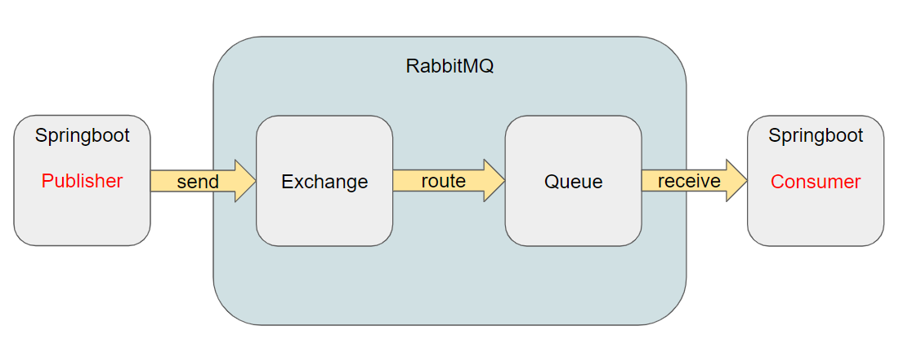
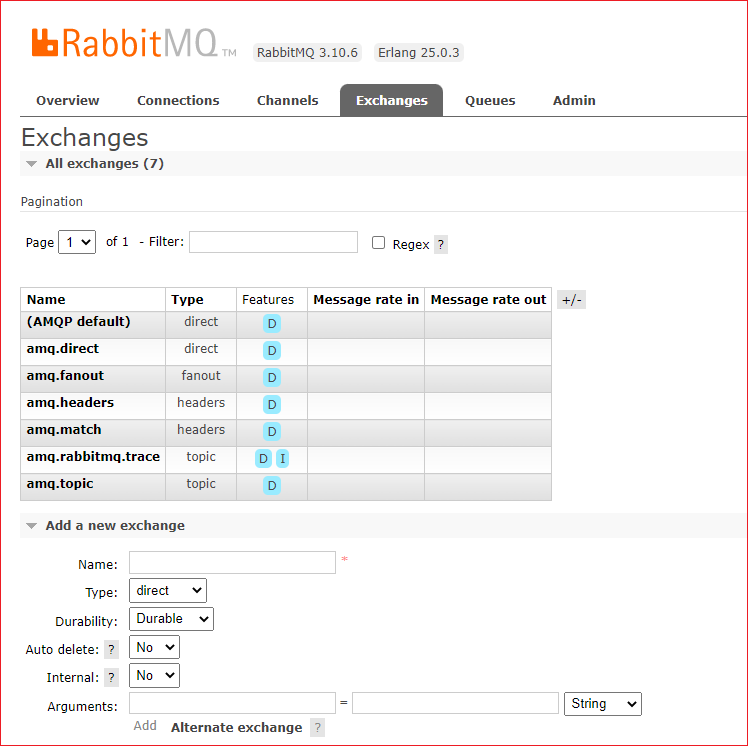
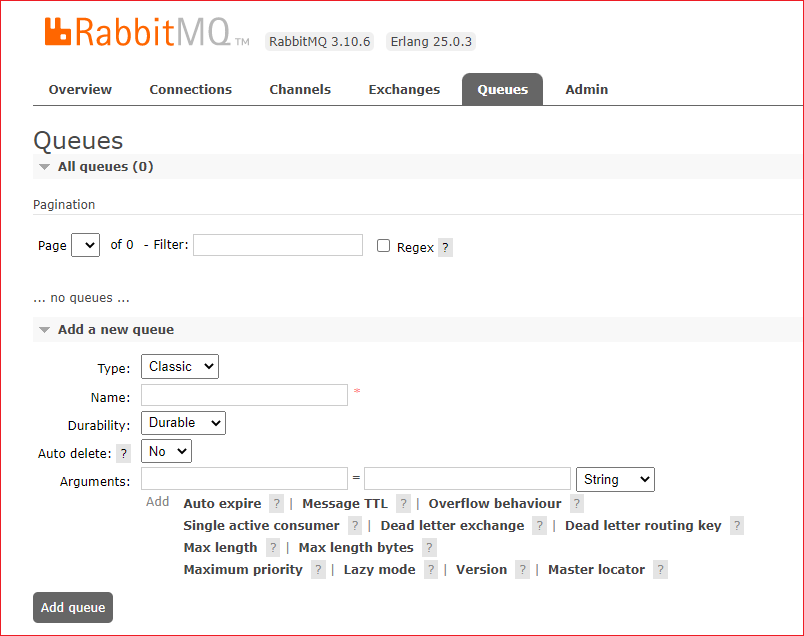

# 개념 

* Publisher(=Provider) 메시지 발생의 주체. RabbitMQ의 API를 이용해 RabbitMQ 영역으로 보낸다. 
* Exchanger 는  메시지를 받아 어느 Queue로 routing 되어야 하는지 판단한다
* 메시지는 Queue에 쌓인다. 
* Consumer는 메세지를 RabbitMQ로부터 전달받을수도 요청을 해서 Queue에 있는 메세지를 fetch or pull  할수 있다.

Publisher는 queue에 직접적으로 연결되는 것이 아니라 exchange를 거쳐 queue에 연결된다.

* RabbitMQ에서는 특정 queue를 식별하기 위해서 Queue에 이름을 부여한다.
* Exchange도 마찬가지로 이름을 통해 특정 exchange를 식별한다.

RabbitMQ는 Exchange와 Queue를 연결하기 위해서 binding key라는 것을 부여한다.
예) "R.svg", "G.jpg" 같은 것들

## Exchange

생성된 Exchange 에는 전달 받은 메시지를 원하는 Queue 로 전달하기 위해 Bindings 이라는 규칙을 정의할 수 있다.  간단하게 목적지 Queue 이름만으로도 Binding 을 추가할 수 있고, 일부 Exchange type 에 따라 routing key 를 지정해서 메시지를 필터링 한 후 지정한 Queue 로 보내도록 정의할 수 있다.

RabbitMQ에서 binding key를 매칭 방법을 통해 메시지를 전달하기 위한 방법은 4가지가 존재한다.
여기서 매칭 대상은 routing key를 말하며, routing key는 publisher가 publish를 할때 지정할 수 있다.

 

* **Name** Exchange 이름
* **Type**
    * **Direct**  routing key와 binding key가 정확히 일치해야 한다. 정확히 하나의 큐에 메시지가 전달된다.
    * **fanout** routing key를 무시하고, 연결된 모든 큐에 메시지를 전달한다.
    * **headers** 메시지 헤더를 통해 binding key 만을 사용하는 것보다 더 다양한 속성을 사용할 수 있다.routing key를 무시하고, key:value 로 이루어진 헤더 값으로 매칭을 한다.
이때 헤더는 Publish할때와 Queue와 Exchange를 바인딩할때 설정된다.Header exchange를 사용하면 binding key는 무시되고, 헤더 값이 바인딩 시 지정된 값과 같은 경우에만 일치하는 것으로 간주한다.
    * **topic**  패턴을 통해 routing key와 binding key를 매칭한다. 하나 이상의 큐에 메시지가 전달된다.
* **Durability**
    * **Durable**  브로커가 재시작 되어도 디스크에 저장되어 남아 있고
    * **Transient** 브로커가 재시작 되면 사라진다
* **AutoDelete** 
    * **No**
    * **Yes** 마지막 Consumer 가 구독을 끝내는 경우 자동으로 삭제된다.    
* **Internal** deprecated
    * **No**
    * **Yes** 
* **Arguments** 

Topic Exchange 에서 사용하는 binding key 는 점(.)으로 구분된 단어를 조합해서 정의한다.

* 와 #을 이용해 와일드 카드를 표현할 수 있으며, * 는 단어 하나 일치 # 는 0 또는 1개 이상의 단어 일치를 의미한다.

## 큐
Consumer 어플리케이션은 Queue 를 통해 메시지를 가져간다. Queue 는 반드시 미리 정의해야 사용할 수 있다.

 

**Add a new que**     
* **Type** 
    * **classic**
    * **Quorum**
    * **Stream**
* **Name**  큐 이름 
* **Durability**
    * **Durable**  브로커가 재시작 되어도 디스크에 저장되어 남아 있고
    * **Transient** 브로커가 재시작 되면 사라진다
* **AutoDelete** 
    * **No**
    * **Yes** 마지막 Consumer 가 구독을 끝내는 경우 자동으로 삭제된다.
* **Arguments** 메시지 TTL, Max Length 같은 추가 기능을 명시한다.

## 사전작업

RabbitMQ Management에 가서 Exchange와 Queue, Routing key를 생성해 놓자. 

Exchanges 탭으로 간다. 

Add a new exchange 클릭한다. 

Exchange : sample.exchange
Queue : sample.queue
Routing key : sample.oingdaddy.# 

# References
[Springboot + RabbitMQ 연동 및 초간단 샘플 프로젝트 만들기](https://oingdaddy.tistory.com/166)    
[RabbitMQ 동작 이해하기](https://jonnung.dev/rabbitmq/2019/02/06/about-amqp-implementtation-of-rabbitmq/)      